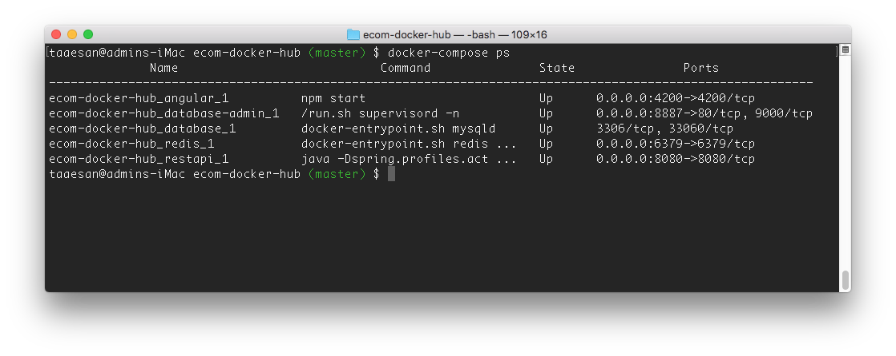

# ecom-docker-hub
The docker to deliver image of e-commerce application.

1. Run git, `git clone https://github.com/taaesan/ecom-docker-hub.git` 
2. Run docker, `docker-compose up`

3. Open browser with `http://localhost:4200`

