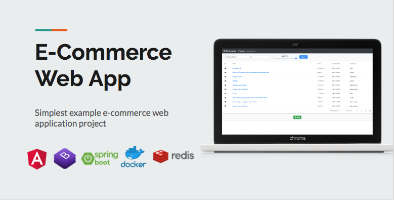
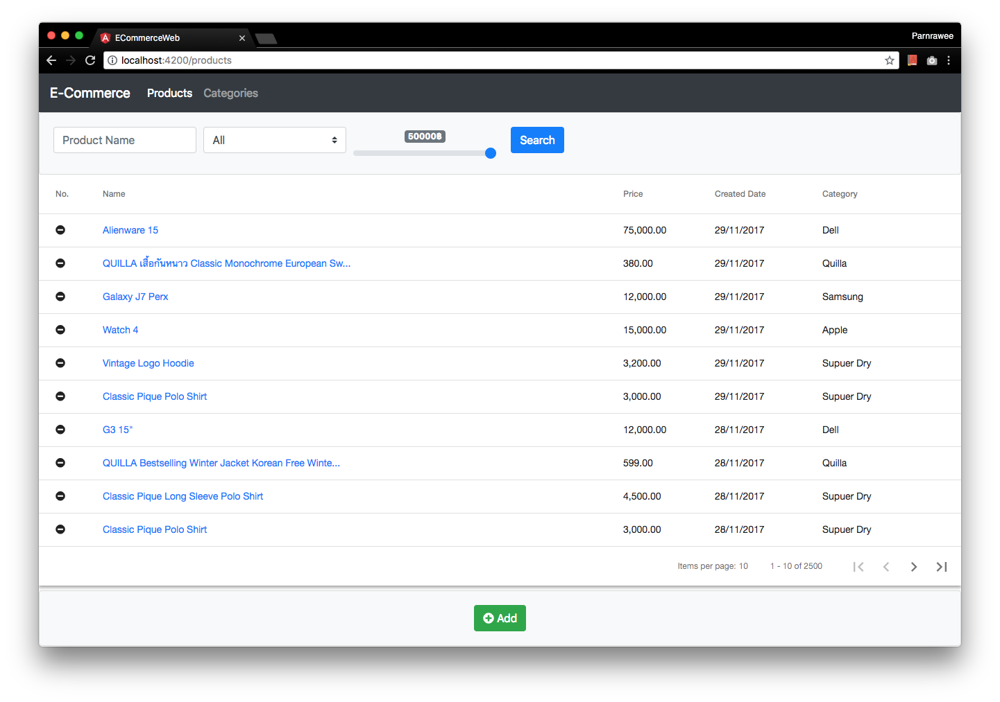

# E-Commerce Sample
Delivery images of e-commerce application.

### Prerequisites
[Docker Desktop](https://www.docker.com/products/docker-desktop) - To run docker engine
[Git](https://git-scm.com/downloads) - To clone git repository

### How to run application
1. Run git, `git clone https://github.com/taaesan/ecom-docker-hub.git` 
2. Run docker, `docker-compose up`

3. Open browser with `http://localhost:4200`

## Authors

* **Parnrawee Phumkhem** - *Initial work* - [taaesan](https://github.com/taaesan)
